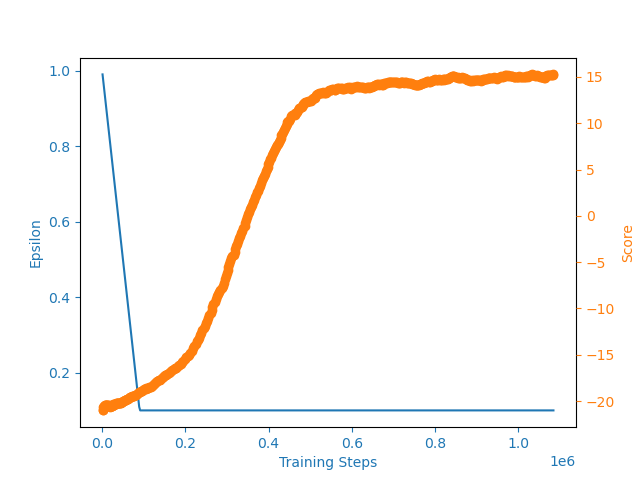
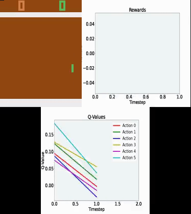

# Deep Q Learning to Achieve Human-Level Performance on the Atari 2600 Games

## Overview

The purpose of this repository is to emulate the results of Mnih _et al._'s paper _Human level control through deep reinforcement learning_. This paper uses deep q-learning to train an agent to play Atari games and achieve results similar to human performance. This paper is significant because the deep q-network only intakes the game pixels and no other context or game information. Furthermore, the exact same parameters and architecture are used when training for a variety of Atari games, showing the flexibility and robustness of this artificial agent in learning and succeeding in a variety of challenging tasks. The results of this paper are similar to human performance and outperform all previous algorithms. 

## Repository Implementation

This implementation method is based on Phil Tabor's Udemy course, [Modern Reinforcement Learning: Deep Q Learning in PyTorch](https://www.udemy.com/course/deep-q-learning-from-paper-to-code/), where he implements Mnih _et al._'s paper in the section Deep Q Learning Paper to Code. The results of this paper are achieved after training for weeks with higher powered computational resources than accessible to most people. To make training easier, this implementation based on Phil Tabor's Udemy course alters a few parameters to decrease computation expense, namely decreasing the agent's memory size. Two other important features of this paper are the ideas of experience replay and the periodic update of Q. These features are key to the high performance of this artificial agent.

### Experience Replay

Experience replay stores the state, action, and reward for a certain time step t in addition to the resulting state. These memories are then uniformly sampled when the network is updated. This uniform sampling is important becuase it essentially ensures that we are not looking at a string of observations from a single episode that may be correlated with one another. 

### Periodic Q Updates

The second important feature is the periodic updates to Q which reduce correlations with the target. Weights from the main neural network are copied over and used to update the target network periodically. 

These two ideas of experience replay and periodic Q updates help make this implementation more stable because the same network is used to choose an action and to estimate the value of that action. In summary, first, experience replay helps solve the problem of correlations in sequences of observations by uniformly sampling from stored experiences. Second, periodic Q updates help solve the issue of correlations between the action values Q and the target values by periodically copying main network weights to update the target network.

## Results on Pong

The deep Q-network (DQN) agent was then trained on Pong, which requires less computation power than other games. Pong is a 2-player, table-tennis-like game, each controlling one paddle that can move up and down. The objective is to move the paddle to bounce the ball back to the opponent. A point is earned if the opponent fails to return the ball. 

The plot below shows the training results on Pong using this PyTorch implementation. The blue indicates the epsilon value and the orange indicates the score. We can see that this methods plateaus around a score of about 15 out of a maximum of 21 points. Note that this is slightly lower than paper results due to differences in computational power during the training process.

### Agent Playing Pong in Early Training Stages

The video below shows the agent (green) playing Pong in the early stages of training. We can see that the agent performs poorly, failing to return the ball. Furthermore, we can see that the rewards and Q-values are both relatively low. 

### Agent Playing Pong in Later Training Stages

As the agent trains more, we can see that its performance improves significantly. The agent (green) can now not only return the ball but also return it in a way that makes it difficult for the opponent to return the ball, leading to the agent winning the game. Likewise, we can see that in comparison to early stage performance, the reward and Q-values are consistently higher now that the agent has trained more. 

## Train it Yourself!

To train the DQN Agent using this repository, clone the repository then run the `main_dqn.py` file in `dqn_pytorch`. (Note: This takes several hours to run)

`git clone https://github.com/vmtang11/deep_rl_atari.git`

Within the `dqn_pytorch` directory, run:

`python main_dqn.py`
